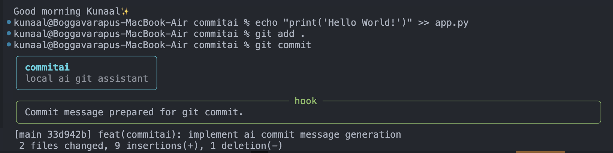

# CommitAI

> Local-first AI Git assistant for Conventional Commits, changelogs, and PR descriptions.

[](https://www.python.org/)
[](https://ollama.com/)
[](https://ollama.com/library/gemma4)
[](#license)

CommitAI turns staged git diffs into clean Conventional Commit messages, concise changelog entries, and practical PR descriptions. It runs entirely on your machine with Ollama and Gemma 4, making it a fast, private, offline-friendly Git assistant built for real developer workflows.

---

## Demo

Go to Demo Folder and download the mp4 file...

CommitAI can auto-generate commits from staged diffs, support a `git commit` hook workflow, and keep `CHANGELOG.md` updated without relying on any external API.

---

## Features

- AI-generated Conventional Commit messages
- Automatic changelog generation
- PR description generation
- Git hook integration
- Fully local using Ollama
- Gemma 4 powered
- Rich terminal UI
- No external APIs
- Offline-first workflow

---

## Why CommitAI

Writing commit messages is one of those tasks every developer does constantly and usually does at the end of a session when context is already fading. The result is the same repetitive workflow: inspect the diff, decide on a commit type, summarize the change, then repeat it again for changelog notes or a pull request description.

CommitAI removes that friction. It uses the staged diff as context, drafts the message for you, and keeps the whole workflow local. That means you get a faster loop without cloud dependency, external API keys, or source code leaving your machine.

---

## Architecture

```text
Git Diff
↓
CommitAI
↓
Ollama API
↓
Gemma 4
↓
AI-generated commit/changelog
↓
Git commit execution
```

The flow is intentionally small: CommitAI reads staged changes, sends a focused prompt to Ollama, normalizes the model output into a Conventional Commit format, writes the changelog entry, and then completes the git workflow.

---

## Installation

```bash
git clone https://github.com/Yuvakunaal/CommitAI.git
cd CommitAI
python3 -m pip install -r requirements.txt
```

Install and start Ollama if needed:

```bash
ollama serve
ollama pull gemma4:e2b
```

Set up the git hook:

```bash
chmod +x hooks/prepare-commit-msg
cp hooks/prepare-commit-msg .git/hooks/prepare-commit-msg
```

---

## Usage

Basic commit flow:

```bash
python commitai.py
```

Runs the full local workflow: reads the staged diff, generates a commit message, updates the changelog, and commits the result.

Skip the confirmation prompt:

```bash
python commitai.py --no-confirm
```

Useful when you already trust the generated message and want a faster path to the final commit.

Generate a PR description:

```bash
python commitai.py --pr
```

Prints a concise pull request description based on the staged diff instead of creating a commit.

Use a different Ollama model:

```bash
python commitai.py --model llama3
```

This is handy if you want to compare models or switch to another local model.

Commit directly with git once the hook is installed:

```bash
git commit
```

The hook triggers CommitAI during `prepare-commit-msg`, so the generated message becomes part of the same commit flow.

---

## Git Hook Setup

CommitAI includes a `prepare-commit-msg` hook for automatic commit message generation.

1. Make the hook executable:

```bash
chmod +x hooks/prepare-commit-msg
```

2. Copy it into Git's hook directory:

```bash
cp hooks/prepare-commit-msg .git/hooks/prepare-commit-msg
```

3. Commit normally:

```bash
git commit
```

The hook uses `COMMITAI_HOOK=1` so CommitAI writes the generated message into Git's commit message file instead of recursively invoking another commit.

---

## Why Gemma 4

CommitAI uses `gemma4:e2b` because it is a strong fit for a lightweight local workflow. It is small enough to run comfortably on an 8 GB MacBook Air, fast enough for developer feedback loops, and capable enough to summarize staged diffs into useful commit messages and changelog entries.

That matters here because the task is not open-ended chat. It is structured reasoning over a git diff. Gemma 4 handles that well while keeping inference local, private, and dependable for everyday use.

- Lightweight local model
- Fast enough for commit workflows
- Well suited to low-memory systems
- Strong enough for diff summarization
- Privacy-friendly local inference

---

## Screenshots

<table>
	<tr>
		<td align="center">
			
			<br />
			<sub>CLI output</sub>
		</td>
	</tr>
</table>

---

## Roadmap

- Semantic release notes
- Multi-model support
- VS Code extension
- Diff summarization
- Team changelog modes

---

## Tech Stack

- Python
- Ollama
- Gemma 4
- Rich
- Git hooks

---

## Contributing

Contributions are welcome. Keep changes focused, readable, and local-first. If you're proposing a new feature, prefer simple implementations that preserve the current developer workflow instead of adding unnecessary abstraction.

1. Fork the repository
2. Create a branch for your change
3. Test the workflow locally
4. Open a pull request with a clear description

---

## License

MIT
